# Informe Final: Segmentador Inteligente de Clientes Minoristas

**Proyecto:** Modulo #7 - Aprendizaje de Maquina No Supervisado  
**Herramientas:** Python, scikit-learn, matplotlib, seaborn, scipy

---

## 1. Introduccion y Objetivo (Leccion 1: Fundamentos del Aprendizaje No Supervisado)

El presente informe documenta el desarrollo de un sistema de segmentacion de clientes
a partir de datos transaccionales de una tienda de e-commerce. El objetivo es identificar
grupos de comportamiento relevantes mediante tecnicas de aprendizaje no supervisado,
visualizarlos y evaluar los hallazgos para su aplicacion en campanas de marketing
diferenciadas.

Se aplicaron tecnicas de:
- **Reduccion dimensional:** PCA y t-SNE
- **Clusterizacion:** K-Means, DBSCAN y agrupamiento jerarquico
- **Evaluacion:** Coeficiente de silueta y metodo del codo

---

## 2. Preprocesamiento de Datos (Leccion 2: Tecnicas de Clusterizacion)

### 2.1 Dataset original

El dataset `online_retail.csv` contiene 541,909 registros transaccionales con 8 columnas:
InvoiceNo, StockCode, Description, Quantity, InvoiceDate, UnitPrice, CustomerID y Country.

### 2.2 Limpieza realizada

| Paso | Descripcion | Impacto |
|------|-------------|---------|
| 1 | Eliminar filas sin CustomerID | -135,080 filas |
| 2 | Eliminar devoluciones (InvoiceNo con prefijo 'C') | Remover transacciones negativas |
| 3 | Eliminar Quantity <= 0 y UnitPrice <= 0 | Remover registros invalidos |
| 4 | Eliminar descripciones nulas | Integridad de datos |

**Resultado:** 397,884 transacciones limpias.

### 2.3 Ingenieria de features (RFM)

Se transformaron las transacciones individuales en un perfil por cliente usando el modelo RFM:

| Feature | Definicion | Interpretacion |
|---------|-----------|----------------|
| **Recency** | Dias desde la ultima compra hasta la fecha de referencia | Menor = mejor |
| **Frequency** | Cantidad de facturas unicas | Mayor = mejor |
| **Monetary** | Gasto total acumulado | Mayor = mejor |

Se generaron perfiles para 4,372 clientes unicos.

### 2.4 Eliminacion de outliers

Se aplico el metodo IQR (rango intercuartilico x 1.5) sobre las 3 columnas RFM:
- Clientes antes: 4,372
- Clientes eliminados: 770
- **Clientes finales: 3,602**

### 2.5 Estandarizacion

Se aplico `StandardScaler` para normalizar las features a media=0 y desviacion estandar=1,
requisito necesario para los algoritmos de clustering y reduccion dimensional.

**Graficos generados:**

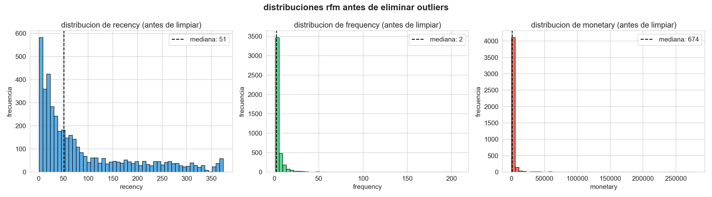

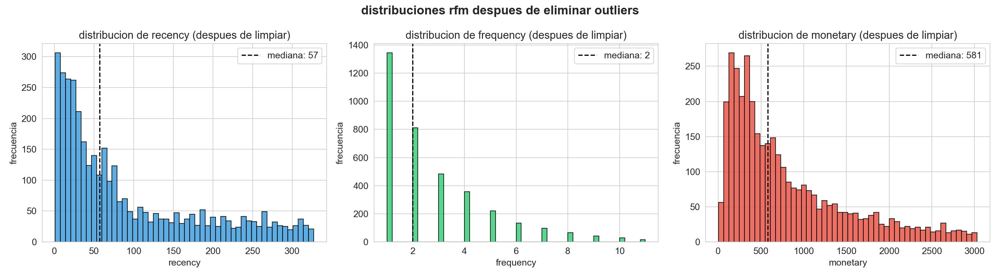

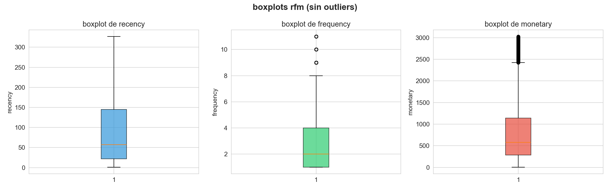

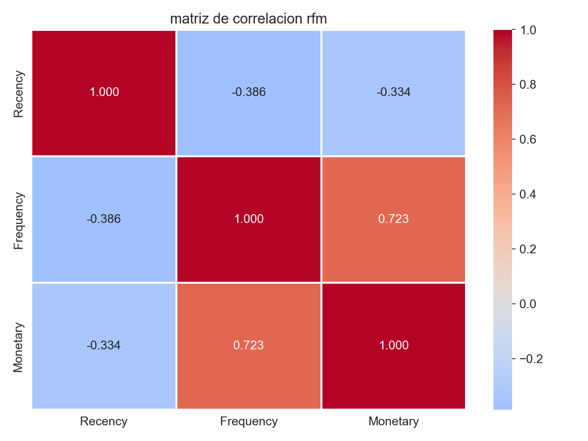

---

## 3. Reduccion Dimensional (Leccion 3)

### 3.1 PCA (Analisis de Componentes Principales)

PCA es una tecnica lineal que proyecta los datos en direcciones de maxima varianza.

**Resultados:**

| Componente | Varianza explicada | Varianza acumulada |
|------------|-------------------|-------------------|
| PC1 | 53.76% | 53.76% |
| PC2 | 37.08% | 90.84% |
| PC3 | 9.16% | 100.00% |

Con solo 2 componentes se captura el **90.84%** de la varianza total, lo cual es
suficiente para una visualizacion efectiva de los datos.

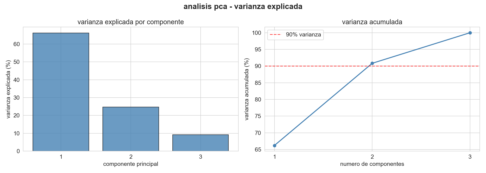

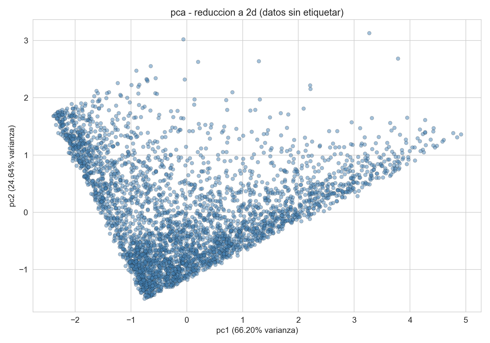

### 3.2 t-SNE (t-Distributed Stochastic Neighbor Embedding)

t-SNE es una tecnica no lineal optimizada para visualizacion en 2D. Preserva las
relaciones locales entre puntos, revelando agrupaciones que PCA podria no detectar.

**Parametros utilizados:** perplexity=30, learning_rate=200, max_iter=1000, random_state=42.

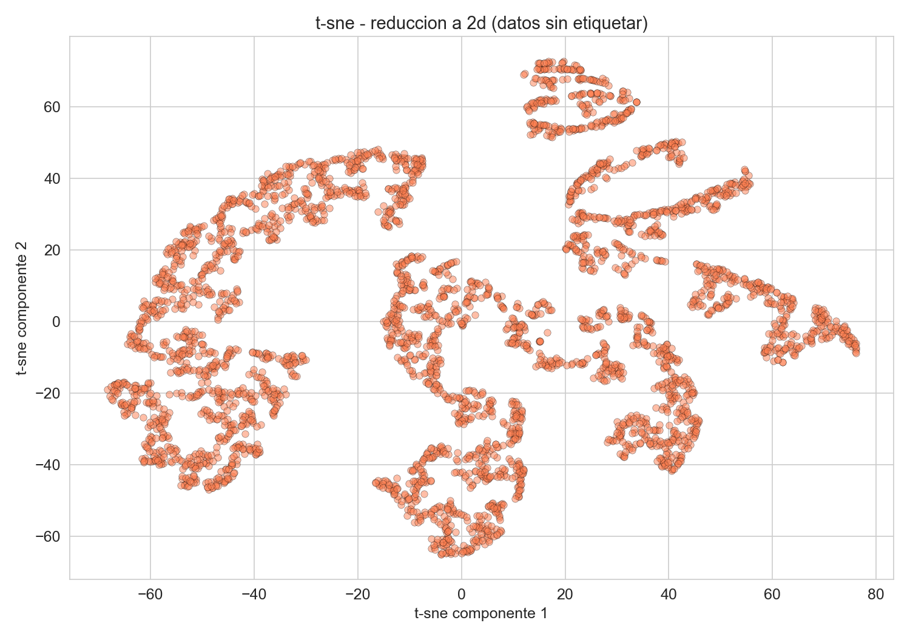

### 3.3 Comparativa PCA vs t-SNE

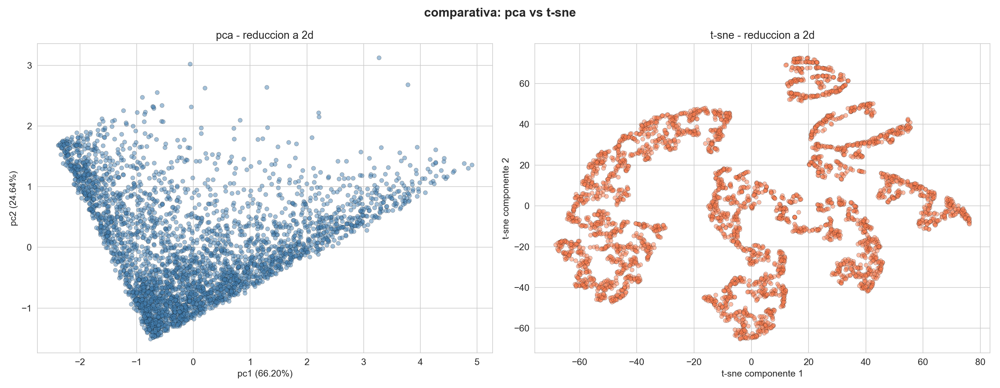

| Criterio | PCA | t-SNE |
|----------|-----|-------|
| Tipo | Lineal | No lineal |
| Varianza explicada | 90.84% (2 comp.) | No aplica |
| Separacion visual | Preserva estructura global | Mejor separacion local |
| Interpretabilidad | Alta | Baja |
| Uso en pipelines | Si | No (solo visualizacion) |
| Reproducibilidad | Total | Parcial (depende de seed) |
| Velocidad | Rapido | Lento O(n^2) |

**Justificacion:** Para este problema usamos PCA como metodo principal de visualizacion
porque es interpretable y preserva la estructura global. t-SNE complementa revelando
agrupaciones locales que confirman la existencia de segmentos naturales.

---

## 4. Clusterizacion (Leccion 4)

### 4.1 Determinacion del numero optimo de clusters

#### Metodo del codo

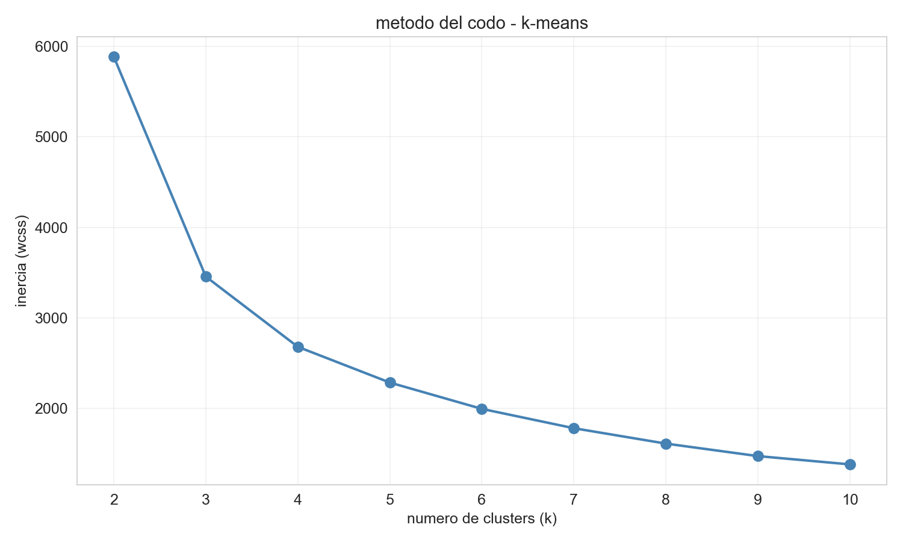

Se observa una inflexion en k=3, indicando que agregar mas clusters no reduce
significativamente la inercia (WCSS).

#### Coeficiente de silueta

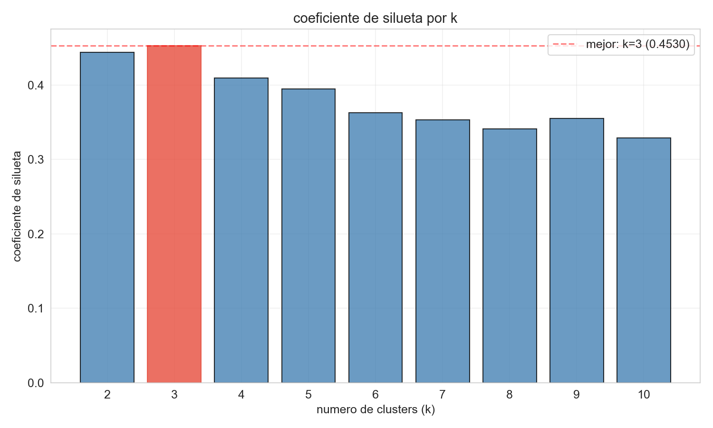

El maximo coeficiente de silueta se alcanza en **k=3** (silueta = 0.4530),
confirmando que 3 clusters es el numero optimo.

### 4.2 K-Means (k=3)

K-Means particiona los datos en k clusters minimizando la suma de distancias
al centroide mas cercano. Es rapido, escalable y funciona bien con clusters
esfericos.

- **Silueta: 0.4530**
- Cluster 0: 820 clientes (22.8%)
- Cluster 1: 1,876 clientes (52.1%)
- Cluster 2: 906 clientes (25.2%)

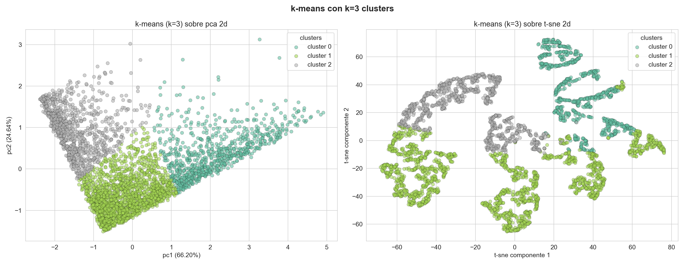

### 4.3 DBSCAN

DBSCAN detecta clusters de forma arbitraria basandose en densidad. No requiere
definir k previamente e identifica puntos de ruido.

Se determino el parametro eps mediante el k-distance plot:

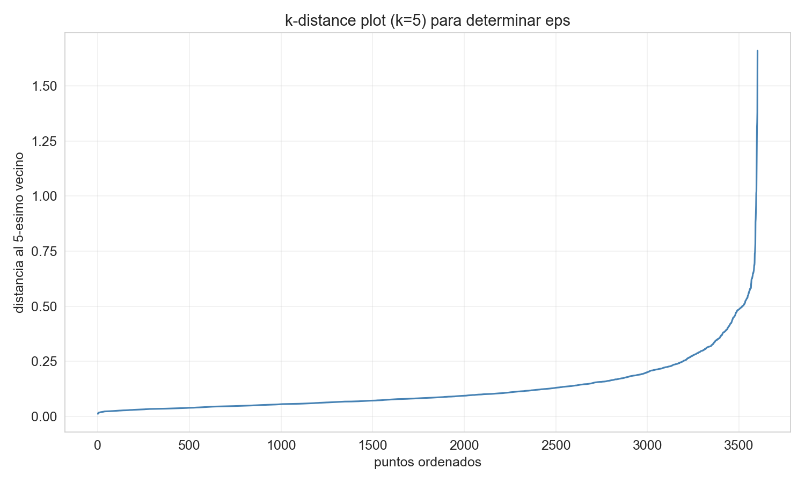

Se exploraron multiples valores de eps, seleccionando **eps=0.4** como optimo:

- **Clusters encontrados: 11**
- **Puntos de ruido: 102**
- **Silueta (sin ruido): 0.0569**

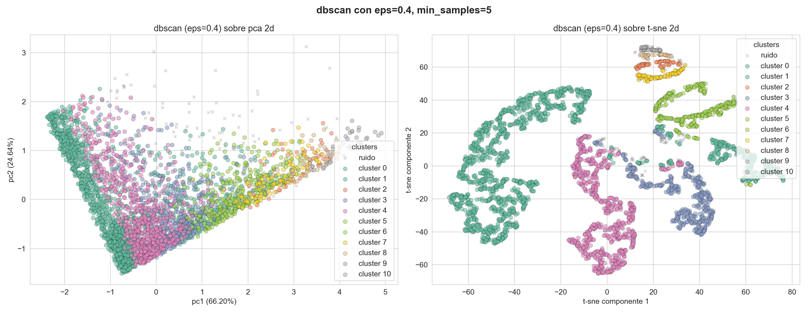

DBSCAN genero muchos micro-clusters, lo que indica que los datos no tienen
densidades uniformes claramente separadas. Sin embargo, su capacidad de detectar
ruido es valiosa para identificar clientes atipicos.

### 4.4 Agrupamiento Jerarquico (Ward)

El agrupamiento jerarquico aglomerativo construye una jerarquia de clusters
fusionando iterativamente los grupos mas cercanos. El metodo Ward minimiza
la varianza intra-cluster.

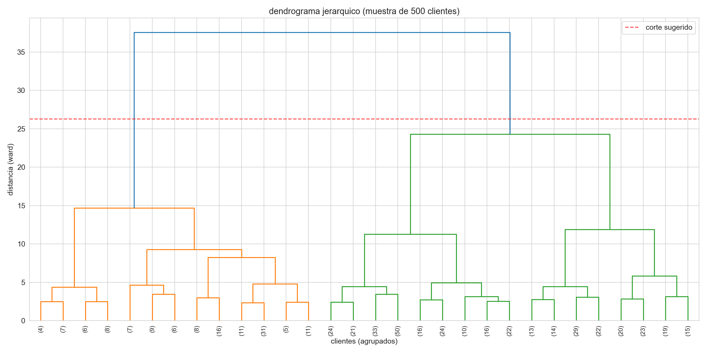

Se aplico AgglomerativeClustering con k=3:

- **Silueta: 0.4217**
- Resultados similares a K-Means pero con silueta ligeramente menor

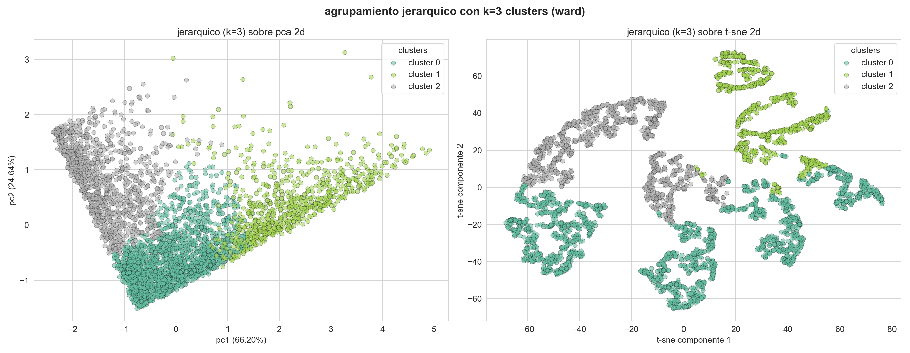

---

## 5. Evaluacion Comparativa (Leccion 5)

### 5.1 Tabla comparativa

| Algoritmo | Clusters | Silueta | Observaciones |
|-----------|----------|---------|---------------|
| **K-Means** | **3** | **0.4530** | **Mejor rendimiento general** |
| DBSCAN | 11 | 0.0569 | Detecta ruido (102 puntos) |
| Jerarquico (Ward) | 3 | 0.4217 | Captura jerarquias |

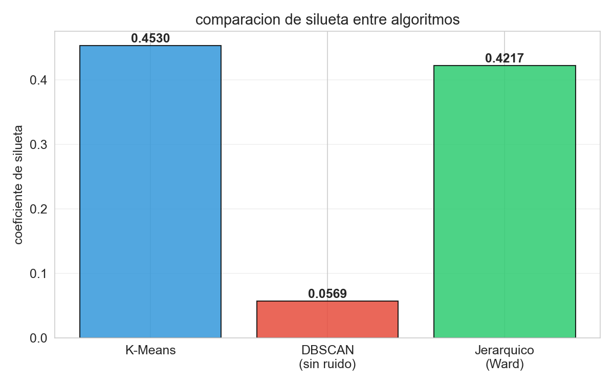

**K-Means es el mejor modelo** con la silueta mas alta (0.4530), indicando
clusters compactos y bien separados.

### 5.2 Comparacion visual de los 3 algoritmos

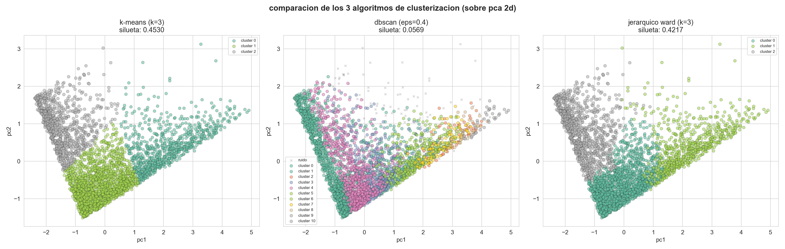

### 5.3 Perfil RFM por cluster (K-Means)

| Cluster | Recency (dias) | Frequency (compras) | Monetary (gasto) |
|---------|---------------|--------------------|--------------------|
| 0 | 37.1 | 5.7 | $1,847.40 |
| 1 | 49.6 | 2.0 | $558.53 |
| 2 | 227.9 | 1.5 | $404.72 |

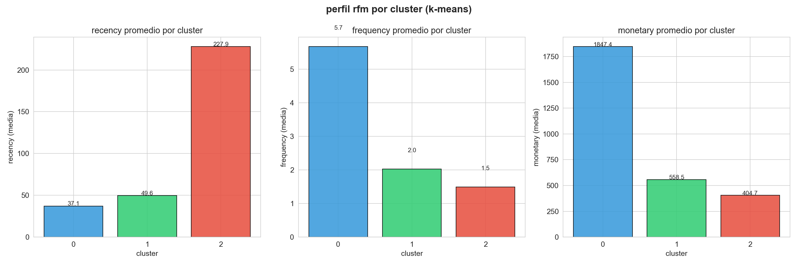

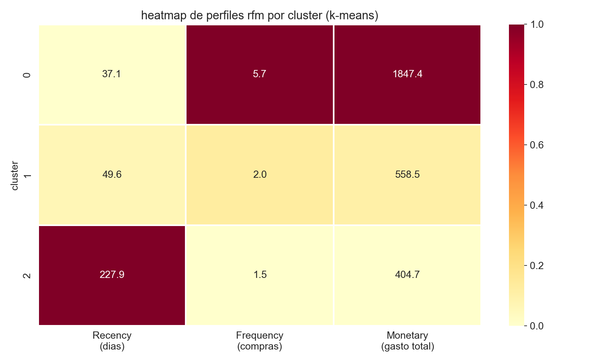

---

## 6. Interpretacion Comercial de Segmentos

### Cluster 0: CLIENTES VIP / CHAMPIONS (820 clientes - 22.8%)

- **Perfil:** Recency=37 dias, Frequency=5.7, Monetary=$1,847
- **Descripcion:** Compradores frecuentes, recientes y de alto valor. Son los mejores
  clientes de la empresa.
- **Accion sugerida:** Programas de fidelizacion premium, acceso anticipado a nuevos
  productos, descuentos exclusivos.

### Cluster 1: CLIENTES REGULARES / PROMETEDORES (1,876 clientes - 52.1%)

- **Perfil:** Recency=50 dias, Frequency=2.0, Monetary=$559
- **Descripcion:** Compradores con frecuencia y gasto moderados. Tienen potencial de
  convertirse en clientes VIP.
- **Accion sugerida:** Campanas de upselling, descuentos por volumen, email marketing
  con recomendaciones personalizadas.

### Cluster 2: CLIENTES EN RIESGO / DORMIDOS (906 clientes - 25.2%)

- **Perfil:** Recency=228 dias, Frequency=1.5, Monetary=$405
- **Descripcion:** No han comprado recientemente y tienen baja frecuencia. Riesgo de
  abandono o ya inactivos.
- **Accion sugerida:** Campanas de reactivacion, cupones de descuento, ofertas flash,
  evaluar costo-beneficio de recuperacion.

---

## 7. Conclusiones

1. El analisis RFM permitio transformar datos transaccionales en features significativas
   por cliente (Recency, Frequency, Monetary).

2. PCA demostro que 2 componentes capturan el 90.84% de la varianza, suficiente para
   una visualizacion efectiva de la estructura de los datos.

3. t-SNE complementa a PCA revelando agrupaciones locales que confirman la existencia
   de segmentos naturales en los datos.

4. K-Means fue el algoritmo con mejor desempeno segun el coeficiente de silueta (0.4530),
   generando 3 clusters compactos y bien separados.

5. DBSCAN permitio detectar clientes atipicos (ruido), que corresponden a comportamientos
   de compra unicos, pero no genero clusters tan coherentes como K-Means.

6. El dendrograma del agrupamiento jerarquico confirma la estructura de 3 grupos
   sugerida por el metodo del codo y el analisis de silueta.

7. Los segmentos identificados son comercialmente accionables y permiten diferenciar
   estrategias de marketing para clientes VIP, regulares y en riesgo.

---

## 8. Recomendaciones

- **Implementar campanas diferenciadas** por segmento con mensajes y ofertas
  personalizadas para cada grupo
- **Monitorear migracion** de clientes entre segmentos de forma trimestral para
  detectar cambios de comportamiento
- **Enriquecer el modelo** con datos demograficos, geograficos y de productos para
  mayor precision en la segmentacion
- **Usar los clusters como variable** de entrada para modelos predictivos de churn
  (abandono) y valor de vida del cliente (CLV)
- **Priorizar la retencion** de clientes VIP (22.8%) que representan la mayor parte
  del ingreso, y disenar estrategias de upgrade para clientes regulares (52.1%)

---

## 9. Justificacion de Decisiones Tecnicas

| Decision | Justificacion |
|----------|---------------|
| Modelo RFM | Estandar de la industria para segmentacion de clientes. Captura recencia, frecuencia y valor monetario en 3 features interpretables |
| IQR para outliers | Metodo robusto y no parametrico. Elimina valores extremos sin asumir distribucion normal |
| StandardScaler | Necesario para K-Means y PCA que son sensibles a la escala. Centra en 0 y normaliza varianza |
| PCA 2D | Captura 90.84% de varianza con solo 2 componentes. Suficiente para visualizacion |
| t-SNE perplexity=30 | Valor por defecto recomendado. Balancea estructura local y global |
| K-Means como modelo final | Mayor silueta (0.4530). Clusters interpretables y de tamano equilibrado |
| k=3 clusters | Confirmado por metodo del codo y maximo coeficiente de silueta |
| Ward linkage | Minimiza varianza intra-cluster. Genera clusters compactos comparables a K-Means |
